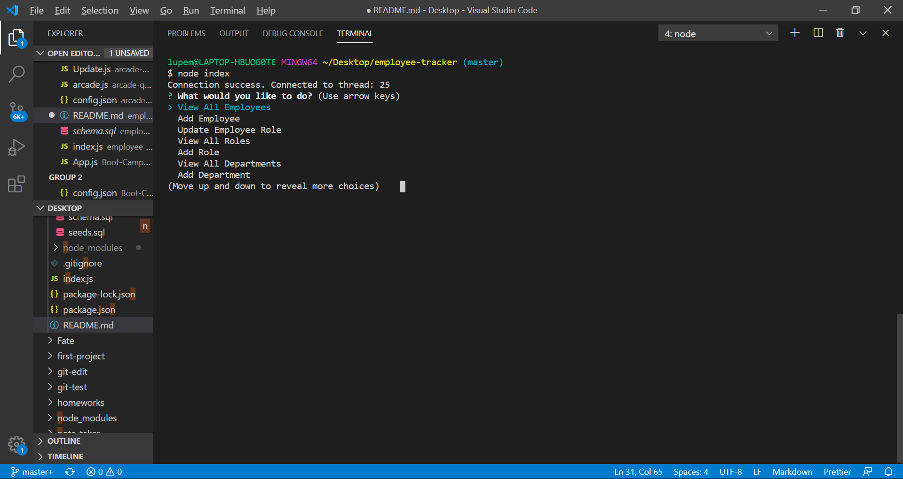

# employee-tracker
Utilizes mysql to view and update employee information

As an employee/ manager,
I want to track my fellow employees and manage departments and roles
So that I can keep them organized and keep track of workers.

Installation:
Clone the repo, and install the node modules through "npm install".

Run the schema.sql file in MySqlWorkbench and run the seeds.sql file to create sample data, or or add your own data to the tables.

Run the program through cli in the terminal, run in the repo folder, using the command "node index"

Select an option using the arrow keys to scroll and using enter to select.

Allows user to view employees, add new empmloyees, update role, view roles, add roles, view departments, and add departments.

Select exit to end the connection.

Picture of the Options you can select:

Pictures showing different functionality that can be used:

Challenges:

Getting the connection queries set up for each function was a pain. It required getting the data and sometimes using that data to find other data.

Joins are also a bit hard to wrap my head around, and took some experimenting to get them to work how I wanted them to.

(Gifs are hard to make, so I settled for a couple of screenshots)